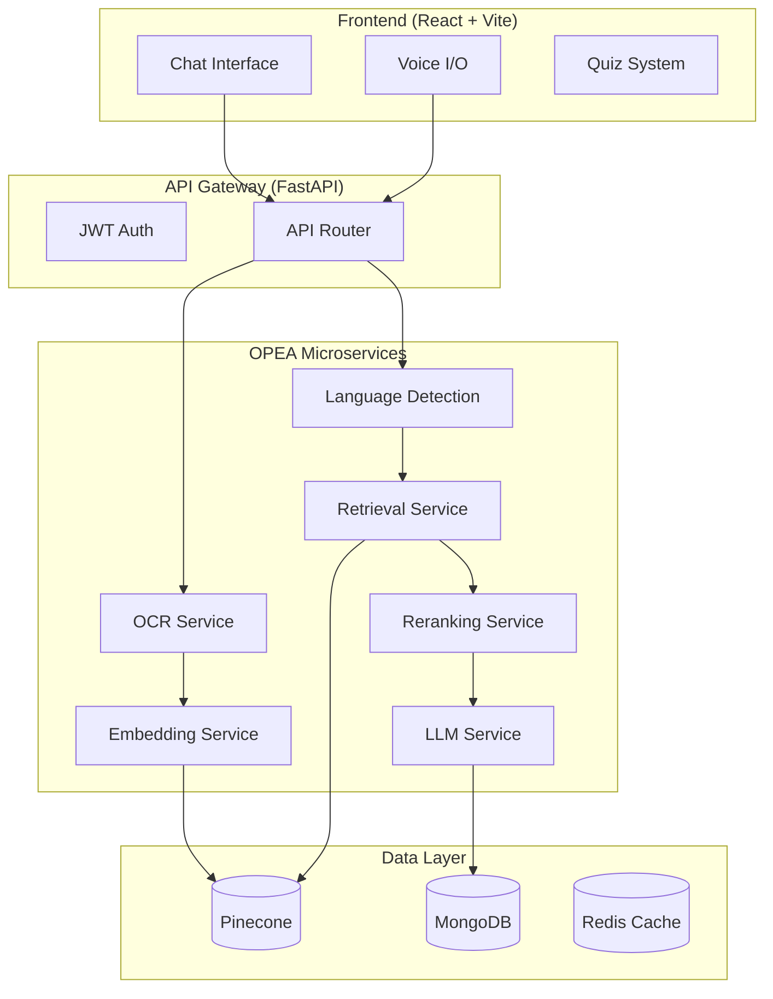

# Multilingual NCERT Doubt-Solver: Django → FastAPI Migration

**Goal**: Migrate from Django to FastAPI while completing the OPEA-based RAG pipeline for multilingual NCERT textbook Q&A.


---

## Current State Analysis

### ✅ Features Already Built
| Feature | Status | Location |
|---------|--------|----------|
| RAG with Pinecone | ✅ Complete | `ncert_project/pinecone_utils.py` |
| MongoDB Integration | ✅ Complete | `ncert_project/mongodb_utils.py` |
| AI Chatbot (OpenAI/Gemini/Local) | ✅ Complete | `students/views.py` |
| Voice I/O | ✅ Complete | `templates/students/chatbot.html` |
| Quiz System | ✅ Complete | `students/quiz_views.py` |
| Unit Tests | ✅ Complete | `students/views.py`, `superadmin/views.py` |
| PDF Upload & Processing | ✅ Complete | `superadmin/tasks.py` |
| OCR (Tesseract) | ✅ Complete | `verify_ocr_setup.py` |
| Student Analytics | ✅ Complete | `superadmin/views.py` |

### ⚠️ Missing for OPEA Compliance
| Feature | Status |
|---------|--------|
| OPEA Architecture | ❌ Not implemented |
| Multilingual Language Detection | ⚠️ Partial |
| Regional Language Fine-tuning | ❌ Not implemented |
| Evaluation Dataset | ❌ Not implemented |
| ≥85% Citation Accuracy Tracking | ❌ Not implemented |

---

## Proposed Architecture



---

## User Review Required

> [!IMPORTANT]
> **Breaking Changes**: This migration will completely replace Django with FastAPI. The current Django templates will be converted to a React/Vite SPA.

> [!WARNING]
> **Database Migration**: MongoDB data will be preserved. SQLite user data needs manual migration.

### Key Decisions Needed:
1. **Frontend Approach**: 
   - Keep current Alpine.js templates (faster, no rewrite needed)
   - Migrate to React SPA (better for mobile, more maintainable)
   
2. **Authentication**: JWT tokens (recommended) or session-based?

3. **Deployment Target**: Docker containers or serverless?

---

## Phased Implementation Plan

### Phase 1: FastAPI Core (Days 1-3)
Create FastAPI backend preserving existing functionality.

#### [NEW] Backend Structure
```
backend/
├── app/
│   ├── main.py              # FastAPI app entry
│   ├── config.py            # Settings from .env
│   ├── api/
│   │   ├── auth.py          # JWT authentication
│   │   ├── chat.py          # Chatbot endpoints
│   │   ├── quiz.py          # Quiz endpoints
│   │   ├── admin.py         # Admin endpoints
│   │   └── upload.py        # PDF upload
│   ├── services/
│   │   ├── rag_service.py   # RAG orchestration
│   │   ├── llm_service.py   # LLM abstraction
│   │   ├── embedding.py     # Embedding service
│   │   └── ocr_service.py   # OCR processing
│   ├── db/
│   │   ├── pinecone.py      # Pinecone ops
│   │   ├── mongodb.py       # MongoDB ops
│   │   └── models.py        # Pydantic models
│   └── utils/
│       ├── cache.py         # Redis caching
│       └── language.py      # Language detection
├── requirements.txt
└── Dockerfile
```

#### Key Files to Create

##### [NEW] [main.py](file:///d:/Projects/ncert-working/backend/app/main.py)
- FastAPI app initialization
- CORS configuration
- Route registration
- Startup/shutdown events for DB connections

##### [NEW] [chat.py](file:///d:/Projects/ncert-working/backend/app/api/chat.py)
- `POST /api/chat` - Main chatbot endpoint
- `POST /api/chat/voice` - Voice input processing
- `GET /api/chat/history` - Chat history retrieval
- WebSocket support for streaming responses

##### [NEW] [rag_service.py](file:///d:/Projects/ncert-working/backend/app/services/rag_service.py)
- OPEA-compliant RAG pipeline
- Grade-specific filtering
- Citation tracking
- Fallback for out-of-scope queries

---

### Phase 2: OPEA RAG Pipeline (Days 4-6)

#### [NEW] OPEA Microservices
Each service follows OPEA specification with standardized interfaces:

```python
# Example OPEA Service Interface
class OPEAService:
    async def process(self, input: ServiceInput) -> ServiceOutput:
        pass
```

##### Services to Implement:
1. **Language Detection Service** - Detect Hindi/English/Urdu/regional
2. **Embedding Service** - Generate vectors with multilingual model
3. **Retrieval Service** - Pinecone query with grade filtering
4. **Reranking Service** - Cross-encoder for relevance
5. **LLM Service** - Gemini/OpenAI with citation formatting

---

### Phase 3: Frontend Migration (Days 7-10)

#### Option A: Keep Alpine.js (Recommended for Speed)
- Convert Django templates to static HTML + Alpine.js
- Serve from FastAPI static files
- Minimal changes, faster completion

#### Option B: React SPA (Recommended for Scale)
```
frontend/
├── src/
│   ├── components/
│   │   ├── Chat/
│   │   │   ├── ChatWindow.jsx
│   │   │   ├── MessageBubble.jsx
│   │   │   └── VoiceInput.jsx
│   │   ├── Quiz/
│   │   └── Dashboard/
│   ├── services/
│   │   └── api.js
│   ├── hooks/
│   │   └── useChat.js
│   └── App.jsx
├── package.json
└── vite.config.js
```

**Current Theme Preserved**: The gradient colors, glassmorphism, and animations will be replicated in the new frontend.

---

### Phase 4: Advanced Features (Days 11-14)

#### Multilingual Support
- [ ] Language detection API (Google/custom model)
- [ ] Hindi, Urdu, Tamil, Telugu support
- [ ] Translation fallback for low-resource languages

#### Evaluation System
- [ ] Create evaluation dataset (100+ Q&A pairs)
- [ ] Citation accuracy tracking
- [ ] Response latency monitoring
- [ ] User feedback collection

#### Performance Optimization
- [ ] Redis caching layer
- [ ] Response streaming
- [ ] Batch embedding
- [ ] Target: ≤3-5s latency

---

## File Migration Map

| Django File | FastAPI Equivalent |
|-------------|-------------------|
| `students/views.py` (ask_chatbot) | `app/api/chat.py` |
| `students/quiz_views.py` | `app/api/quiz.py` |
| `superadmin/views.py` | `app/api/admin.py` |
| `ncert_project/pinecone_utils.py` | `app/db/pinecone.py` |
| `ncert_project/mongodb_utils.py` | `app/db/mongodb.py` |
| `accounts/views.py` | `app/api/auth.py` |

---

## Verification Plan

### Automated Tests
```bash
# Run API tests
pytest backend/tests/ -v

# Performance benchmark
locust -f backend/tests/load_test.py
```

### Manual Verification
1. Chat functionality with all 3 LLM options
2. Voice input/output
3. PDF upload and processing
4. Quiz completion flow
5. Multi-language detection

### Performance Targets
- [ ] Latency ≤ 3-5s (Intel hardware)
- [ ] ≥85% answers with correct citations
- [ ] <500ms API response for cached queries
